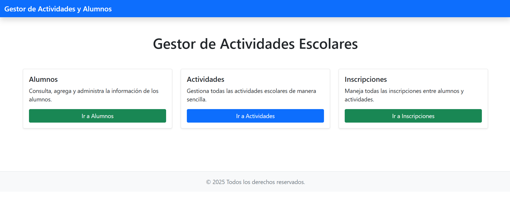
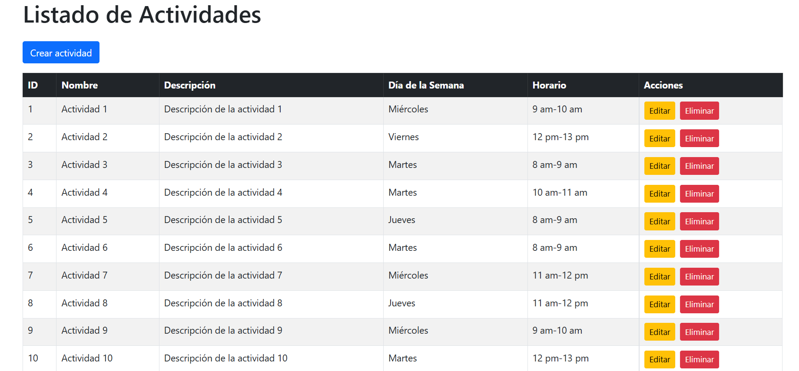
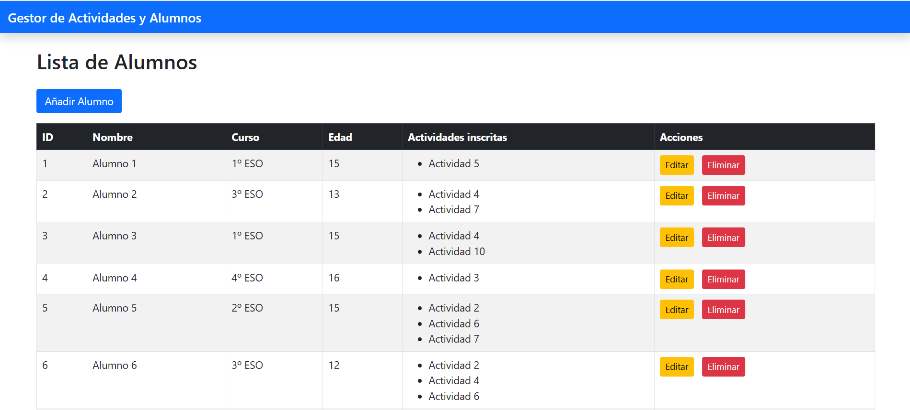
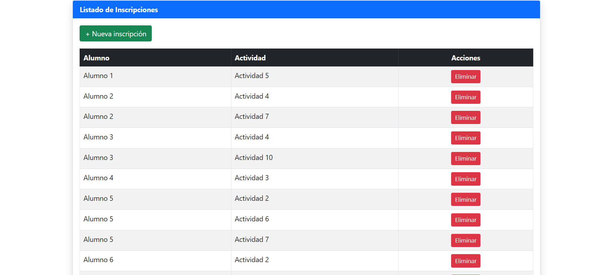

# Proyecto_Final_Laravel_IFCD45

Proyecto final de Laravel curso IFCD45

Este proyecto final consiste en desarrollar una aplicación web con Laravel que simula un gestor de actividades escolares. El objetivo es administrar un catálogo de actividades extraescolares (como robótica, ajedrez, pintura o inglés) y gestionar qué alumnos están inscritos.  
El sistema incluye funcionalidades básicas: registro de actividades, alumnos e inscripciones, así como el uso de vistas Blade, controladores, rutas RESTful, validaciones y exportación de listados.  
A través de este proyecto pondrás en práctica los conocimientos adquiridos durante el curso en PHP, POO, MVC, Laravel y acceso a base de datos con Eloquent ORM. También te prepararás para desarrollar proyectos reales y defender tu trabajo técnico de manera profesional.


---

## ¿Qué hace?

Este proyecto simula un **gestor de alumnos y actividades extraescolares**.  
Permite crear, listar, editar y eliminar **actividades** (como robótica o ajedrez) y **alumnos**. Además, establece relaciones entre ambos a través de una tabla intermedia llamada **Inscripciones**, que gestiona qué alumno está inscrito a qué actividad.  
También se pueden exportar listados y realizar búsquedas básicas.

### 📷 Ejemplo de la vista de actividades:



### 📷 Ejemplo de la vista de alumnos:



### 📷 Ejemplo de la vista de inscripciones:



---

## ¿Cómo lo hice?

- Utilicé **PHP** con el framework **Laravel** como base del proyecto.
- Se aplicó el patrón de diseño **MVC** propio de Laravel para estructurar el código.
- Las vistas se desarrollaron usando **Blade**, el motor de plantillas de Laravel.
- Para los estilos visuales, se empleó **Bootstrap**, logrando una interfaz sencilla y funcional.
- Las rutas siguen el enfoque **RESTful**, con validaciones integradas en los controladores.
- Las relaciones entre entidades se gestionan mediante **Eloquent ORM**, el sistema de base de datos de Laravel.

---

## ¿Qué aprendí?

1. El funcionamiento general de **Laravel** y cómo se estructura un proyecto completo.
2. Cómo usar **Eloquent ORM** para manejar relaciones entre modelos de forma sencilla.
3. Aplicar el patrón **MVC** dentro de Laravel.
4. Crear rutas **API RESTful** y organizar correctamente los controladores.
5. La importancia de las validaciones, la reutilización de vistas y la exportación de datos.
6. Mejores prácticas para el desarrollo de aplicaciones web reales.

---

## Instrucciones de instalación

Sigue estos pasos para clonar y ejecutar el proyecto en tu entorno local:

### 1. Clona el repositorio

```bash
git clone https://github.com/tu-usuario/Proyecto_Final_Laravel_IFCD45.git
cd Proyecto_Final_Laravel_IFCD45
